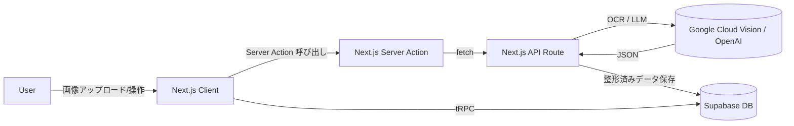
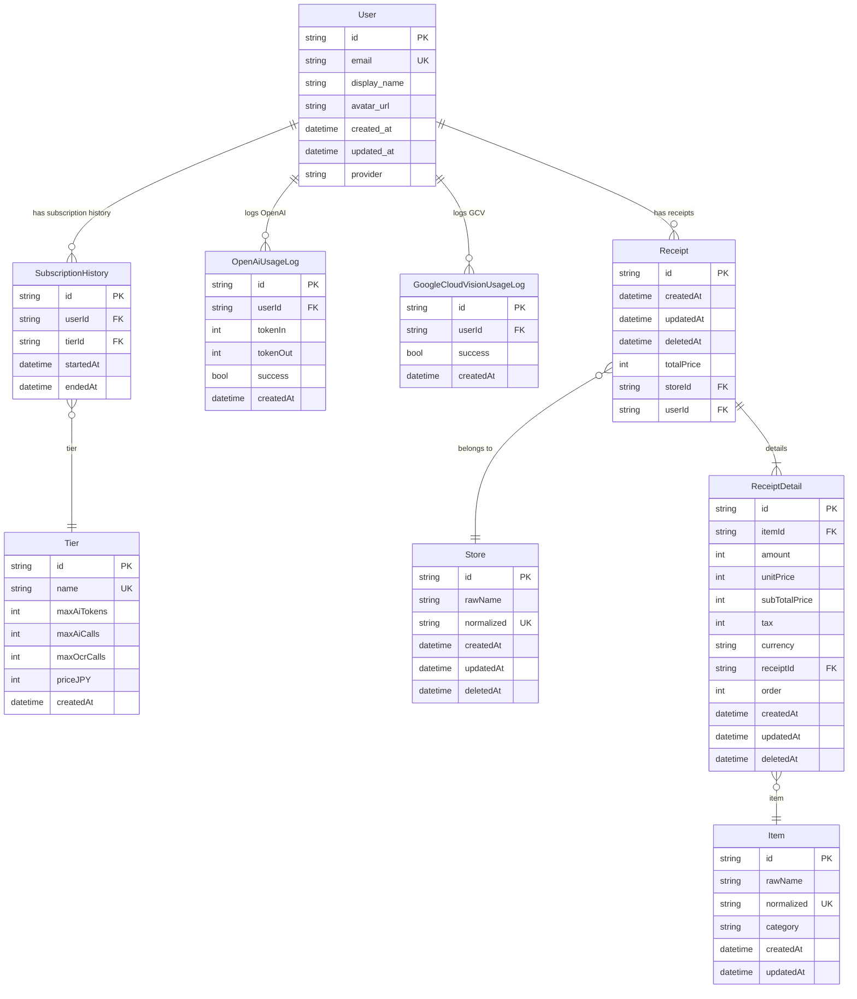

# 🧾 レシート OCR アプリ

## 🎥 概要

伝票データ入力の業務自動化 PoC。

会社で OCR を利用した自動化ツール導入プロジェクト に携わる中で、  
「もっと効率化できる余地がある」と感じ、個人で PoC を開始しました。

特に、

- **マスタ管理（DB + 読み取り位置定義）の工数不足**
- **複数ツール間で操作が往復するオペレーションの煩雑さ**

の 2 点に課題意識を持ち、

OCR + AI（Google Cloud Vision + OpenAI）を利用して、  
**_読み取り位置の定義不要でレシート画像を構造化データとして抽出し、_**  
**_データ登録と商品マスタ登録を一気通貫で Supabase に保存できるフロー を構築しました。_**

---

## 👉 デモ動画（約 30 秒）

https://github.com/user-attachments/assets/547f4e39-49d0-44aa-8dbb-26fa0a53d12c

---

## 🧰 技術スタック

| Category               | Tools / Frameworks                                                          |
| ---------------------- | --------------------------------------------------------------------------- |
| **Frontend**           | Next.js 15 (App Router), React 19, shadcn/ui (Radix ベース), Tailwind CSS 4 |
| **Backend / Data**     | Next.js Server Actions, tRPC 11, Supabase (Auth + DB), Prisma 6             |
| **OCR / AI**           | Google Cloud Vision API, OpenAI API                                         |
| **Validation / Logic** | Zod 3, Effect-TS                                                            |
| **Infrastructure**     | Vercel (Deploy), Supabase (DB / Auth)                                       |
| **Development / DX**   | Bun, Biome, secretlint                                                      |

---

## 🧩 アーキテクチャ図



---

## 🧩 ER 図



---

## 🤖 技術ハイライト

### ① ADT による型安全なエラーハンドリング

エラーを ADT（代数的データ型） として定義し、  
\_tag による明示的な分岐で 型安全にエラーを扱える構造 にした。

<details>
<summary>詳細を開く</summary>

- \_tag フィールドを持つ タグ付き Union 型 でエラー種別を定義
- SupabaseInfraError / SupabaseSessionExchangeError / SupabaseGetUserError を  
  SupabaseTaggedError として統合し、共通インターフェース化
- \_tag によるパターン分岐が可能になり、  
  try/catch を使わず型で保証された安全なエラーハンドリングができる

```TypeScript
export type SupabaseInfraError =
  | { _tag: "SupabaseInitError"; cause: unknown }
  | { _tag: "SupabaseClientError"; cause: unknown };

export type SupabaseSessionExchangeError = {
  _tag: "ExchangeCodeError";
  cause: unknown;
};

export type SupabaseGetUserError =
  | { _tag: "AuthGetUserError"; message: string }
  | { _tag: "AuthNoUserFound" };

export type SupabaseTaggedError =
  | SupabaseInfraError
  | SupabaseSessionExchangeError
  | SupabaseGetUserError;

```

</details>

### ② 関数型ライブラリ (Effect) に挑戦。

副作用を型安全に扱うために、TypeScript 向けの関数型エフェクトライブラリ Effect-TS を活用。  
例外処理や依存注入を関数的に整理し、より安全で再利用しやすいロジック設計を目指した。

<details>
<summary>詳細を開く</summary>

- Effect のパイプ構文で 処理の流れを宣言的に記述
- 例外処理を try/catch ではなく Effect 型で一元管理
- Prisma / Supabase などの 依存性をレイヤとして注入
- ドメイン・インフラ・ユースケースを 明確に分離して疎結合化
- サービス境界をまたぐ処理を 副作用の少ない合成関数として表現

1. インフラ層: Prisma サービスの定義

```TypeScript
import { PrismaClient } from "@prisma/client";
import { Context, Effect, Layer } from "effect";
import type { PrismaTaggedError } from "../_error/prisma.error";

export class PrismaService extends Context.Tag("PrismaService")<
  PrismaService,
  { prisma: PrismaClient }
>() {}

export const makePrismaService = Effect.try({
  try: () => ({ prisma: new PrismaClient() }),
  catch: (cause): PrismaTaggedError => ({
    _tag: "PrismaServiceInitError",
    cause,
  }),
});

export const PrismaServiceLayer = Layer.effect(
  PrismaService,
  makePrismaService,
);

```

2. ドメイン層： サブスクリプション Tier のバリデーション

   ```TypeScript
   import { toUnknownError } from "@/lib/_error/common.error";
   import type { SubscriptionHistoryValidationError } from "@/lib/_error/subscription.error";
   import {
     type SubscriptionHistory,
     SubscriptionHistorySchema,
   } from "@/lib/_model/user/subscriptionHistory.schema";
   import { Effect } from "effect";
   import { ZodError } from "zod";

   export const toSubscriptionHistoryParseError = (
     e: unknown,
   ): SubscriptionHistoryValidationError => {
     if (e instanceof ZodError) return { _tag: "TierInvalid", cause: e };
     return toUnknownError(e);
   };

   export const parseSubscriptionHistory = (
     subscriptionHistory: unknown,
   ): Effect.Effect<
     SubscriptionHistory,
     SubscriptionHistoryValidationError,
     never
   > =>
     Effect.try({
       try: () => {
         console.log(subscriptionHistory);
         const parsed = SubscriptionHistorySchema.safeParse(subscriptionHistory);
         console.log(parsed);
         if (!parsed.success) throw parsed.error;
         return parsed.data;
       },
       catch: toSubscriptionHistoryParseError,
     });

   ```

3. ユースケース層: 有効なサブスクリプションの取得

   ```TypeScript
   import { formatSubscriptionResult } from "@/lib/_domain/subscription/formatSubscriptionResult";
   import { parseSubscriptionHistory } from "@/lib/_domain/subscription/parseSubscriptionHistory";
   import type {
     GetActiveSubscriptionError,
     SubscriptionResult,
   } from "@/lib/_error/subscription.error";
   import type { UserId } from "@/lib/_model/user/user.schema";
   import type { PrismaService } from "@/lib/_services/prismaService";
   import { fetchActiveSubscription } from "@/lib/_services/subscription/fetchActiveSubscription";
   import { Effect, pipe } from "effect";

   export const getActiveSubscription = (
     userId: UserId
   ): Effect.Effect<
     SubscriptionResult,
     GetActiveSubscriptionError,
     PrismaService
   > =>
     pipe(
       fetchActiveSubscription(userId),
       Effect.flatMap(parseSubscriptionHistory),
       Effect.flatMap(formatSubscriptionResult)
     );

   ```

4. プレゼンテーション層: GoogleCloudVision 呼び出し時に、サブスクリプション情報をチェック

   ```TypeScript
   export async function runGoogleCloudVision(input: unknown) {
       const flow = pipe(
         mainLogic(input), // 内部で getActiveSubscription -> checkGcvLimit

         Effect.provide(PrismaServiceLayer), // Prismaサービスの注入
         Effect.provide(...),
         Effect.provide(...),
       );

       return await Effect.runPromise(flow);
     }
   ```

</details>

### ③ Google Cloud Vision の疑似 Deskew（傾き補正）設計

GCV の生データを数学的に補正することで OCR 後の構造化精度を高める目的。  
現段階では平均傾きを用いた簡易 Deskew。

<details>
<summary>詳細を開く</summary>

- GCV API の boundingPoly（文字領域の座標）を解析し、  
  各単語の傾きをベクトル化して平均角度を算出
- 平均傾きをもとに各単語の座標を補正して行単位に再構成
- 下図は傾いたレシートの例と、算出された頂点ベクトル分布

| レシート（ダミー）                                                                                                                                                  | GCV の Bounding Box                                                                                                                                              | ベクトルの角度分布                                                                                                                                        |
| ------------------------------------------------------------------------------------------------------------------------------------------------------------------- | ---------------------------------------------------------------------------------------------------------------------------------------------------------------- | --------------------------------------------------------------------------------------------------------------------------------------------------------- |
|  |  |  |

- 傾きを推定して補正する処理（一部抜粋）

  ```TypeScript
  export function groupWordsWithDeskew(words: WordInfo[], imageHeight: number): string[] {
  const yThreshold = imageHeight \* 0.02;
  const angles = words
  .map(w => w.boundingBox.vertices)
  .filter(v => v?.length >= 2)
  .map(v => Math.atan2(v[1].y - v[0].y, v[1].x - v[0].x));

  const avg = angles.length ? angles.reduce((a, b) => a + b, 0) / angles.length : 0;
  const slope = Math.tan(avg);

  const grouped: Record<string, string[]> = {};
  for (const w of words) {
  const v = w.boundingBox.vertices[0] ?? { x: 0, y: 0 };
  const ry = v.y - slope \* v.x;
  const key = String(Math.round(ry / yThreshold));
  (grouped[key] ??= []).push(w.text);
  }

  return Object.values(grouped).map(line => line.join(" "));
  }

  ```

</details>

### ④ フロント側での OCR 画像の前処理パイプライン（試験的）

OCR の読み取り精度向上のために行った画像の前処理方法の検討

<details>
<summary>詳細を開く</summary>

- OpenCV.js (WASM) でグレースケール化・CLAHE・適応的二値化・形態学的変換までの 前処理パイプラインを試作
- フロントでプレビューできるようにして、ユーザーが目で見て読み取り安さを確認できるようにした
- ただし今回のレシート画像の範囲では Google Cloud Vision が十分に高精度だったため、  
  本番 API 呼び出しには前処理を組み込んでいない
- 将来的に画質が悪いスキャンやレシート以外の伝票を扱う場合の 拡張ポイントとして残してある

- 型定義（一部抜粋）

  ```TypeScript
  export interface CV {
    getBuildInformation(): string;
    Mat: {
      new (): Mat;
      new (rows: number, cols: number, type: number): Mat;
    };
    rectangle(img: Mat, pt1: Point, pt2: Point, color: Scalar, thickness?: number): void;
    rotate(src: Mat, dst: Mat, rotateCode: number): void;
    // ...
  }
  ```

- 画像処理

  ```TypeScript
  // 1. グレースケール化
  cv.cvtColor(src, gray, cv.COLOR_RGBA2GRAY);

  // 2. CLAHE: 適応ヒストグラム平坦化
  clahe.apply(gray, enhanced);

  // cv.bilateralFilter(gray, denoised, 9, 75, 75);

  // 3. 適応的二値化
  cv.adaptiveThreshold(
    enhanced,
    bin,
    255,
    cv.ADAPTIVE_THRESH_GAUSSIAN_C,
    cv.THRESH_BINARY,
    adaptiveBlockSize,
    adaptiveC,
  );

  // 4. 形態学的変換（OPEN -> CLOSE）
  cv.morphologyEx(bin, bin, cv.MORPH_OPEN, kernelOpen);
  cv.morphologyEx(bin, bin, cv.MORPH_CLOSE, kernelClose);

  // 5. メディアンフィルタ
  cv.medianBlur(bin, denoised, medianLimit);

  // 6. 最終Morphology（もう一度OPEN）
  cv.morphologyEx(bin, denoised, cv.MORPH_OPEN, kernelFinish);

  // 7. denoisedだけ呼び出し元に渡す
  return denoised.clone(); // 呼び出し元で delete() してね
  ```

</details>

### ⑤ インクリメンタルサーチ＋楽観更新の入力 UI

UX のために 検索 + マスタ変更 + 選択肢 を一体化したプルダウンメニューを作成

<details>
<summary>詳細を開く</summary>

- 入力中のキーワードを 300ms デバウンス して tRPC で検索、候補を Command(Popover) に表示
- 候補がなければその場で 「新しい商品」フォームに切り替えて登録 → 即選択 までを 1 コンポーネントで完結
- 選択したアイテムは親に onSelect(item) で即返すので、UI 上は楽観的に反映、裏側で DB 更新が失敗したら差し戻せる構成
- shadcn/ui + lucide の素直な実装で、再利用しやすい入力パターン（検索 or 新規作成） を作った

```tsx
const { data: suggestions = [] } = trpc.item.search.useQuery(
  { keyword: debouncedInput, limit: 5 },
  { enabled: debouncedInput.trim().length > 1 }
);
```

</details>
