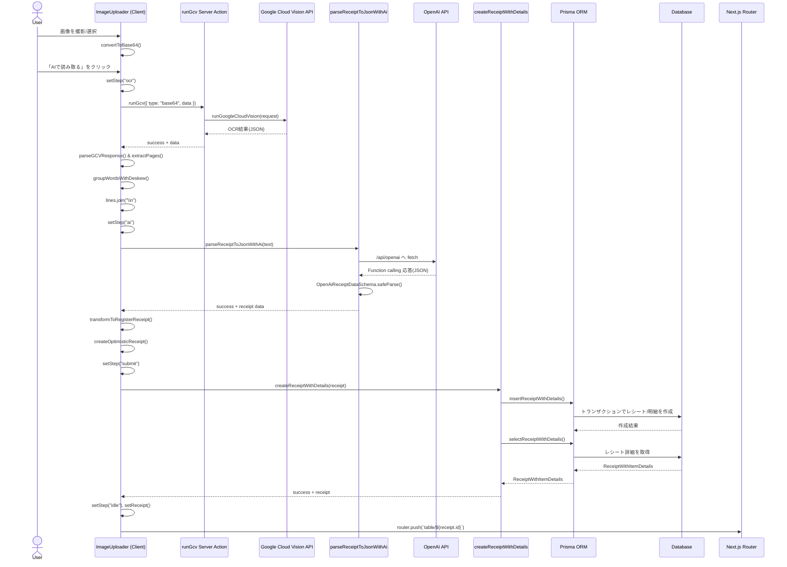
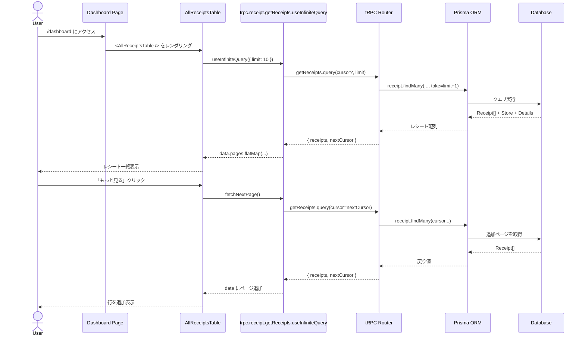
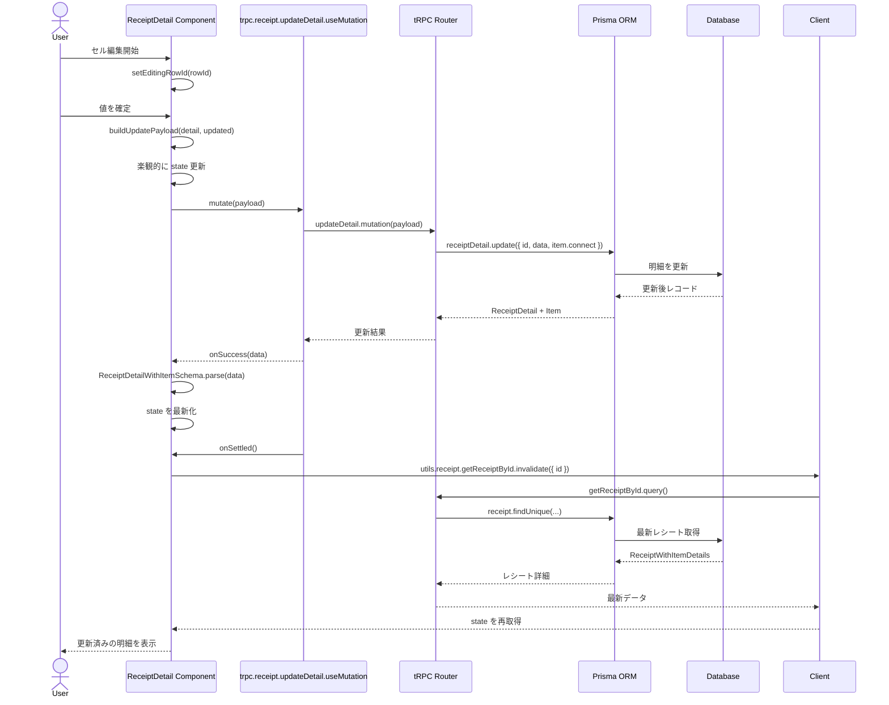

# シークエンス図

## レシートOCR登録フロー

```mermaid
sequenceDiagram
    actor User
    participant UI as ImageUploader (Client)
    participant OCR as runGcv Server Action
    participant GCV as Google Cloud Vision API
    participant Parser as parseReceiptToJsonWithAi
    participant OpenAI as OpenAI API
    participant ReceiptSvc as createReceiptWithDetails
    participant Prisma as Prisma ORM
    participant DB as Database
    participant Router as Next.js Router

    User->>UI: 画像を撮影/選択
    UI->>UI: convertToBase64()
    User->>UI: 「AIで読み取る」をクリック
    UI->>UI: setStep("ocr")
    UI->>OCR: runGcv({ type: "base64", data })
    OCR->>GCV: runGoogleCloudVision(request)
    GCV-->>OCR: OCR結果(JSON)
    OCR-->>UI: success + data
    UI->>UI: parseGCVResponse() & extractPages()
    UI->>UI: groupWordsWithDeskew()
    UI->>UI: lines.join("\\n")
    UI->>UI: setStep("ai")
    UI->>Parser: parseReceiptToJsonWithAi(text)
    Parser->>OpenAI: /api/openai へ fetch
    OpenAI-->>Parser: Function calling 応答(JSON)
    Parser->>Parser: OpenAiReceiptDataSchema.safeParse()
    Parser-->>UI: success + receipt data
    UI->>UI: transformToRegisterReceipt()
    UI->>UI: createOptimisticReceipt()
    UI->>UI: setStep("submit")
    UI->>ReceiptSvc: createReceiptWithDetails(receipt)
    ReceiptSvc->>Prisma: insertReceiptWithDetails()
    Prisma->>DB: トランザクションでレシート/明細を作成
    DB-->>Prisma: 作成結果
    ReceiptSvc->>Prisma: selectReceiptWithDetails()
    Prisma->>DB: レシート詳細を取得
    DB-->>Prisma: ReceiptWithItemDetails
    Prisma-->>ReceiptSvc: ReceiptWithItemDetails
    ReceiptSvc-->>UI: success + receipt
    UI->>UI: setStep("idle"), setReceipt()
    UI->>Router: router.push(`table/${receipt.id}`)
```

## レシート一覧（無限スクロール）

```mermaid
sequenceDiagram
    actor User
    participant Dashboard as Dashboard Page
    participant Table as AllReceiptsTable
    participant Client as trpc.receipt.getReceipts.useInfiniteQuery
    participant Router as tRPC Router
    participant Prisma as Prisma ORM
    participant DB as Database

    User->>Dashboard: /dashboard にアクセス
    Dashboard->>Table: <AllReceiptsTable /> をレンダリング
    Table->>Client: useInfiniteQuery({ limit: 10 })
    Client->>Router: getReceipts.query(cursor?, limit)
    Router->>Prisma: receipt.findMany(..., take=limit+1)
    Prisma->>DB: クエリ実行
    DB-->>Prisma: Receipt[] + Store + Details
    Prisma-->>Router: レシート配列
    Router-->>Client: { receipts, nextCursor }
    Client-->>Table: data.pages.flatMap(...)
    Table-->>User: レシート一覧表示
    User->>Table: 「もっと見る」クリック
    Table->>Client: fetchNextPage()
    Client->>Router: getReceipts.query(cursor=nextCursor)
    Router->>Prisma: receipt.findMany(cursor...)
    Prisma->>DB: 追加ページを取得
    DB-->>Prisma: Receipt[]
    Prisma-->>Router: 戻り値
    Router-->>Client: { receipts, nextCursor }
    Client-->>Table: data にページ追加
    Table-->>User: 行を追加表示
```

## レシート明細の編集

```mermaid
sequenceDiagram
    actor User
    participant DetailUI as ReceiptDetail Component
    participant Mutation as trpc.receipt.updateDetail.useMutation
    participant Router as tRPC Router
    participant Prisma as Prisma ORM
    participant DB as Database

    User->>DetailUI: セル編集開始
    DetailUI->>DetailUI: setEditingRowId(rowId)
    User->>DetailUI: 値を確定
    DetailUI->>DetailUI: buildUpdatePayload(detail, updated)
    DetailUI->>DetailUI: 楽観的に state 更新
    DetailUI->>Mutation: mutate(payload)
    Mutation->>Router: updateDetail.mutation(payload)
    Router->>Prisma: receiptDetail.update({ id, data, item.connect })
    Prisma->>DB: 明細を更新
    DB-->>Prisma: 更新後レコード
    Prisma-->>Router: ReceiptDetail + Item
    Router-->>Mutation: 更新結果
    Mutation-->>DetailUI: onSuccess(data)
    DetailUI->>DetailUI: ReceiptDetailWithItemSchema.parse(data)
    DetailUI->>DetailUI: state を最新化
    Mutation->>DetailUI: onSettled()
    DetailUI->>Client: utils.receipt.getReceiptById.invalidate({ id })
    Client->>Router: getReceiptById.query()
    Router->>Prisma: receipt.findUnique(...)
    Prisma->>DB: 最新レシート取得
    DB-->>Prisma: ReceiptWithItemDetails
    Prisma-->>Router: レシート詳細
    Router-->>Client: 最新データ
    Client-->>DetailUI: state を再取得
    DetailUI-->>User: 更新済みの明細を表示
```
